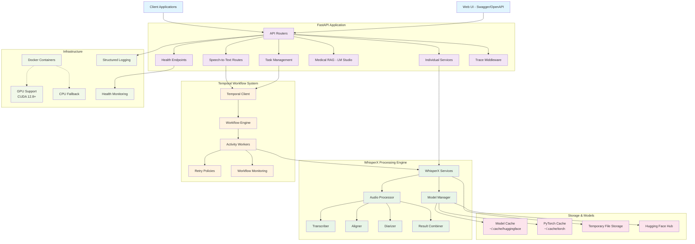

# whisperX REST API

The whisperX API is a production-ready tool for enhancing and analyzing audio content using advanced speech processing technologies. This API provides a comprehensive suite of services for processing audio and video files, including transcription, alignment, diarization, and **medical RAG integration with local LLMs via LM Studio**.

> **NEW: Medical RAG Integration** - Process medical consultations with local LLMs (MedAlpaca, Meditron) using LM Studio's OpenAI-compatible API for HIPAA-compliant PHI detection, entity extraction, and SOAP note generation. See [Medical RAG Setup](#medical-rag-with-lm-studio) below.

## System Architecture

The whisperX-FastAPI system is built with a modern, scalable architecture that leverages Temporal for workflow orchestration and provides robust error handling and monitoring capabilities.



## Usage

### Docker Setup (Recommended)

For the fastest and most consistent setup, use Docker Compose:

```bash
# 1. Copy and configure environment
cp .env.example .env
# Edit .env with your HF_TOKEN and other settings

# 2. Start all services (CPU version)
docker-compose up -d

# 3. Or start with GPU support (requires NVIDIA Container Toolkit)
docker-compose -f docker-compose.gpu.yaml up -d

# 4. Access the API
# API Documentation: http://localhost:8000/docs
# Temporal Web UI: http://localhost:8233
```

📖 **See [DOCKER.md](docs/DOCKER.md) for comprehensive Docker setup guide**

### Local Run

1. **Install uv**: Follow the official instructions at [astral.sh/uv](https://astral.sh/uv).
2. **Install dependencies**: uv automatically creates and manages the virtual environment
   
   **For CPU-only setup (macOS/Linux without NVIDIA GPU):**
   ```sh
   # Install all dependencies (production + development) - CPU only
   uv sync

   # Install only production dependencies - CPU only
   uv sync --no-dev
   ```
   
   **For GPU setup (Linux with NVIDIA GPU):**
   ```sh
   # Install all dependencies including NVIDIA CUDA support
   uv sync --extra gpu

   # Install only production dependencies with GPU support
   uv sync --no-dev --extra gpu
   ```

   *Alternative: Use make commands for streamlined setup: `make install-dev`, `make install-prod`, `make install-dev-gpu`, `make install-prod-gpu`*

5. **Create `.env` file**
    ```sh
    cp .env.example .env
    ```
6. **Run the application: FastAPI + Temporal**:

   To run temporal server locally without docker, you need to install the `temporal` CLI.
   Download and install the latest version for your system from the [official GitHub releases page](https://github.com/temporalio/cli/releases). You will need to move the `temporal` binary to a directory in your `PATH` (e.g., `/usr/local/bin`).

   **Recommended: Start the full application with one command:**
   ```sh
   # Start worker + FastAPI server (full app)
   make dev
   ```

   **Alternative: Manual startup with individual commands:**
   ```sh
   # Start the local temporal server
   make start-temporal

   # Start the FastAPI server (in separate terminal)
   make server

   # Start the Temporal worker (in separate terminal)
   make worker
   ```

   **Process Management:**
   ```sh
   # Stop all running processes (FastAPI, Temporal, worker, etc.)
   make stop

   # Stop only the local temporal server
   make stop-temporal
   ```

The API will be accessible at <http://127.0.0.1:8000>.

#### Model cache

The models used by whisperX are stored in `root/.cache`, if you want to avoid downloanding the models each time the container is starting you can store the cache in persistent storage. `docker-compose.gpu.yml` defines a volume `whisperx-models-cache` to store this cache.

- faster-whisper cache: `root/.cache/huggingface/hub`
- pyannotate and other models cache: `root/.cache/torch`

### Make Commands Reference

The project provides make commands for complex operations that simplify development and deployment:

#### Complex Development Commands
```bash
make dev                   # Start worker + FastAPI server (full app) - RECOMMENDED
make worker                # Start Temporal server + worker
```

#### Process Management
```bash
make stop                  # Stop all running processes (pkill)
make temporal-fresh         # Clean Temporal data and start fresh
make check-activities      # Check running Temporal activities via CLI
```

#### Simple Commands (Direct uv usage preferred)
```bash
uv sync                    # Install development dependencies (CPU only)
uv sync --extra gpu        # Install development dependencies with GPU support
uv run python -m start_server  # Start FastAPI server only
temporal server start-dev   # Start local Temporal server
```

#### Environment Variables
- `TEMPORAL_DB_PATH` - Path for Temporal database (default: `./temporal_data/temporal.db`)

#### Getting Help
```bash
make help                  # Show all available commands and descriptions
```

**Note**: Use `uv sync` directly for simple dependency installation (more transparent). Use make commands for complex workflows like `make dev` (handles worker + server coordination) or `make temporal-fresh` (comprehensive cleanup).

## Documentation

See the [WhisperX Documentation](https://github.com/m-bain/whisperX) for details on whisperX functions.

### Supported File Formats

#### Audio Files

- `.oga`, `.m4a`, `.aac`, `.wav`, `.amr`, `.wma`, `.awb`, `.mp3`, `.ogg`

#### Video Files

- `.wmv`, `.mkv`, `.avi`, `.mov`, `.mp4`

### Available Models

WhisperX supports a comprehensive range of model sizes and specialized variants:

#### Standard Models
- **Tiny**: `tiny`, `tiny.en` (~39MB, fastest)
- **Base**: `base`, `base.en` (~74MB, balanced)
- **Small**: `small`, `small.en` (~244MB, good accuracy)
- **Medium**: `medium`, `medium.en` (~769MB, better accuracy)
- **Large**: `large`, `large-v1`, `large-v2`, `large-v3`, `large-v3-turbo` (~1550MB, best accuracy)

#### Distilled Models (Faster Inference)
- `distil-large-v2`, `distil-medium.en`, `distil-small.en`, `distil-large-v3`

#### Specialized Models
- **CrisperWhisper**: [`nyrahealth/faster_CrisperWhisper`](https://github.com/nyrahealth/CrisperWhisper) - Optimized for medical transcription

#### Model Configuration
- Set default model in `.env` using `WHISPER_MODEL=` (default: `small`)
- Models are automatically downloaded and cached on first use
- GPU models support `float16` and `float32` precision
- CPU models require `int8` quantization for optimal performance

## Medical RAG with LM Studio

### Overview

The whisperX-FastAPI system integrates with **LM Studio** to provide local medical LLM capabilities without external API calls or costs. This enables:

- **PHI Detection & Anonymization**: Identify and protect Protected Health Information
- **Medical Entity Extraction**: Extract diagnoses, medications, procedures, symptoms
- **SOAP Note Generation**: Automated SOAP (Subjective, Objective, Assessment, Plan) documentation
- **Document Structuring**: Organize consultation transcripts into structured medical records
- **RAG Search**: Semantic search across medical consultations using vector embeddings

### Quick Start

#### 1. Install LM Studio
```bash
# Download from https://lmstudio.ai/
# Available for macOS, Windows, and Linux
```

#### 2. Download Medical Models
```
1. Open LM Studio
2. Go to "Discover" tab
3. Search "medalpaca" → Download MedAlpaca-7B
4. Search "nomic" → Download nomic-embed-text-v1.5
5. Go to "Local Server" tab
6. Select MedAlpaca-7B
7. Click "Start Server"
```

#### 3. Configure Application
```bash
# Add to .env
LM_STUDIO_ENABLED=true
LM_STUDIO_BASE_URL=http://localhost:1234/v1
MEDICAL_RAG_ENABLED=true

# Verify LM Studio is running
curl http://localhost:1234/v1/models

# Start application
make dev
```

#### 4. Test Medical Processing
```python
# Example API call
import httpx

response = httpx.post(
    "http://localhost:8000/medical/process",
    json={
        "transcript": "Patient presents with fever and cough...",
        "patient_id": "PATIENT_123"
    }
)

result = response.json()
# Returns: PHI data, medical entities, SOAP note, structured document
```

### Recommended Models

| Model | Size | Purpose | Download |
|-------|------|---------|----------|
| MedAlpaca-7B | ~15GB | Medical text generation | Search "medalpaca" in LM Studio |
| Meditron-7B | ~15GB | Clinical reasoning | Search "meditron" in LM Studio |
| nomic-embed-text-v1.5 | ~800MB | Embeddings for RAG | Search "nomic" in LM Studio |

### Configuration Options

```bash
# .env configuration
LM_STUDIO_ENABLED=true                    # Enable LM Studio integration
LM_STUDIO_BASE_URL=http://localhost:1234/v1  # LM Studio API endpoint
LM_STUDIO_TIMEOUT=120                     # Request timeout (seconds)
LM_STUDIO_TEMPERATURE=0.1                 # Low temp for medical accuracy
LM_STUDIO_MAX_TOKENS=2048                 # Max tokens per response

# Feature flags
MEDICAL_RAG_ENABLED=true                  # Enable medical RAG features
ENABLE_PHI_DETECTION=true                 # Enable PHI detection
ENABLE_ENTITY_EXTRACTION=true             # Enable entity extraction
ENABLE_SOAP_GENERATION=true               # Enable SOAP notes
```

### Performance Expectations

**With 7B Model on GPU (RTX 4090 / A10)**:
- PHI Detection: 2-4 seconds
- Entity Extraction: 3-6 seconds
- SOAP Generation: 5-10 seconds
- **Total**: ~15-25 seconds per consultation

**With 7B Model on CPU**:
- Total: ~50-90 seconds per consultation

### Documentation

- **Setup Guide**: `docs/setup/lm-studio-installation.md`
- **Implementation Plan**: [`plans/lm-studio-medical-rag-implementation.md`](plans/lm-studio-medical-rag-implementation.md)
- **Architecture Decision**: [`docs/adr/006-lm-studio-integration-strategy.md`](docs/adr/006-lm-studio-integration-strategy.md)
- **Cost Analysis**: [`docs/adr/005-cost-effective-infrastructure.md`](docs/adr/005-cost-effective-infrastructure.md)

### API Endpoints

Once Medical RAG is enabled, new endpoints become available:

```bash
POST /medical/process
  - Full medical processing pipeline (PHI, entities, SOAP, structuring)

POST /medical/soap
  - Generate SOAP note only

POST /medical/entities
  - Extract medical entities only

GET /health/lm-studio
  - Check LM Studio service health
```

### Troubleshooting

**LM Studio not responding**:
```bash
# Check if LM Studio is running
curl http://localhost:1234/v1/models

# Restart LM Studio server
# 1. Open LM Studio
# 2. Go to "Local Server" tab
# 3. Click "Stop Server" then "Start Server"
```

**Model not loaded**:
```bash
# Verify model is loaded in LM Studio
# Check "Local Server" tab shows your medical model

# Preload models before starting
python scripts/preload_lm_studio_models.py
```

**Slow processing**:
```bash
# Enable response caching
ENABLE_LLM_CACHING=true

# Use GPU acceleration (if available)
# LM Studio will automatically use GPU when available
```
---

## Troubleshooting

### Common Issues

1. **Model Download Failures**

   - Verify your internet connection.
   - Ensure the `HF_TOKEN` is correctly set in the `.env` file.
   - If you see an error like: `Error: An error happened while trying to locate the file on the Hub and we cannot find the requested files in the local cache`, try these solutions:
     
     a) Check your internet connection
     
     b) Verify your Hugging Face token has permission to access the models:
     ```sh
     # Test your token (replace YOUR_TOKEN with your actual token)
     curl -X GET https://huggingface.co/api/whoami -H "Authorization: Bearer YOUR_TOKEN"
     ```
     
     c) Try pre-downloading the model before running the service:
     ```sh
     # Example for downloading the base model
     python scripts/download_diarization_model.py
     ```

2. **Warnings Not Filtered**
   - Ensure the `FILTER_WARNING` environment variable is set to `true` in the `.env` file.

3. **Process Management Issues**
   - If processes become unresponsive or you need to clean up:
   ```sh
   # Stop all running processes
   make stop
   
   # For a completely fresh Temporal start
   make temporal-fresh
   ```

4. **Temporal Server Issues**
   - If Temporal workflows are stuck or corrupted:
   ```sh
   # Check running activities
   make check-activities
   
   # Clean and restart Temporal
   make temporal-fresh
   ```

5. **Testing Workflow Functionality**
   - To verify the complete workflow is working:
   ```sh
   # Run comprehensive API tests
   make test-api
   ```

#### Workflow Monitoring

- **Temporal Web UI**: Access at `http://localhost:8233` for workflow visualization
- **Workflow Status API**: Track individual workflow progress via REST endpoints
- **Performance Metrics**: Built-in monitoring of processing times and success rates
- **Error Analytics**: Detailed error tracking and retry attempt logging

## Related

- [ahmetoner/whisper-asr-webservice](https://github.com/ahmetoner/whisper-asr-webservice)
- [alexgo84/whisperx-server](https://github.com/alexgo84/whisperx-server)
- [chinaboard/whisperX-service](https://github.com/chinaboard/whisperX-service)
- [tijszwinkels/whisperX-api](https://github.com/tijszwinkels/whisperX-api)
