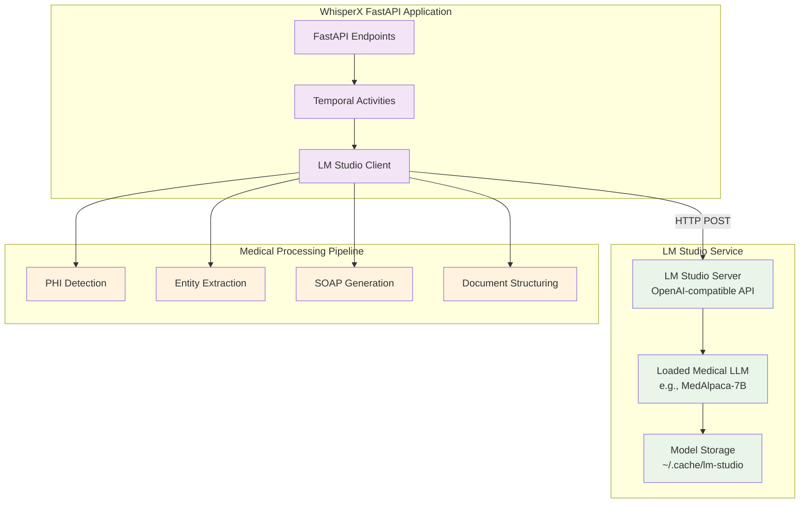

# ADR 002: LM Studio Integration for Local Medical LLM Operations

**Date**: 2025-12-13  
**Status**: Proposed  
**Decision Makers**: ML Engineering & Architecture Teams  
**Related**: [ADR 001](001-performance-optimization-strategy.md), [ADR 002](002-medical-nlp-model-selection.md), [ADR 004](004-hipaa-compliance-opensource.md)

## Context

The Healthcare RAG integration requires medical LLM capabilities while maintaining:
- **Complete data privacy**: No external API calls, all processing on-premises
- **HIPAA compliance**: Full control over PHI data
- **Flexibility**: Easy model switching and testing
- **Developer experience**: Simple setup and debugging

**Current Challenge**: Original ADR 002 proposed direct HuggingFace Transformers integration, which requires:
- Complex model loading and management code
- Manual GPU memory optimization
- Difficult model switching during development
- Steep learning curve for model configuration

## Decision

Adopt **LM Studio's OpenAI-compatible API** (`http://localhost:1234/v1`) as the primary interface for all medical LLM operations.

### Architecture Overview



### Implementation Strategy

#### 1. LM Studio Client Wrapper

```python
# app/llm/lm_studio_client.py
import httpx
from typing import List, Dict, Optional
from pydantic import BaseModel

class LMStudioConfig(BaseModel):
    """Configuration for LM Studio connection"""
    base_url: str = "http://localhost:1234/v1"
    timeout: int = 120  # Medical text generation can be slow
    max_retries: int = 3
    temperature: float = 0.1  # Low temp for medical accuracy
    max_tokens: int = 2048

class LMStudioClient:
    """OpenAI-compatible client for LM Studio"""
    
    def __init__(self, config: LMStudioConfig = None):
        self.config = config or LMStudioConfig()
        self.client = httpx.AsyncClient(
            base_url=self.config.base_url,
            timeout=httpx.Timeout(self.config.timeout),
        )
    
    async def chat_completion(
        self,
        messages: List[Dict[str, str]],
        temperature: Optional[float] = None,
        max_tokens: Optional[int] = None,
    ) -> str:
        """
        Send chat completion request to LM Studio.
        
        Args:
            messages: List of message dicts with 'role' and 'content'
            temperature: Sampling temperature (default from config)
            max_tokens: Max tokens to generate (default from config)
        
        Returns:
            Generated text response
        """
        response = await self.client.post(
            "/chat/completions",
            json={
                "messages": messages,
                "temperature": temperature or self.config.temperature,
                "max_tokens": max_tokens or self.config.max_tokens,
                "stream": False,
            },
        )
        response.raise_for_status()
        result = response.json()
        return result["choices"][0]["message"]["content"]
    
    async def generate_embedding(self, text: str) -> List[float]:
        """
        Generate embeddings using LM Studio's embedding model.
        
        Args:
            text: Text to embed
        
        Returns:
            Embedding vector
        """
        response = await self.client.post(
            "/embeddings",
            json={
                "input": text,
                "model": "text-embedding-nomic-embed-text-v1.5"  # Default embedding model
            },
        )
        response.raise_for_status()
        result = response.json()
        return result["data"][0]["embedding"]
    
    async def health_check(self) -> bool:
        """Check if LM Studio server is accessible"""
        try:
            response = await self.client.get("/models")
            return response.status_code == 200
        except Exception:
            return False
    
    async def list_models(self) -> List[str]:
        """List available models in LM Studio"""
        response = await self.client.get("/models")
        response.raise_for_status()
        models = response.json()
        return [model["id"] for model in models.get("data", [])]
    
    async def close(self):
        """Close the HTTP client"""
        await self.client.aclose()
```

#### 2. Medical LLM Service Layer

```python
# app/llm/medical_llm_service.py
from typing import Dict, List
from .lm_studio_client import LMStudioClient

class MedicalLLMService:
    """High-level medical LLM operations using LM Studio"""
    
    def __init__(self, client: LMStudioClient):
        self.client = client
    
    async def detect_phi(self, text: str) -> Dict:
        """
        Detect Protected Health Information in text.
        
        Returns:
            Dict with PHI entities and their locations
        """
        messages = [
            {
                "role": "system",
                "content": """You are a HIPAA-compliant PHI detection system. 
Identify and extract all Protected Health Information including:
- Names, addresses, dates
- Phone numbers, emails, SSNs
- Medical Record Numbers (MRNs)
- Account numbers, identifiers
Return results as JSON with entity type, text, and position."""
            },
            {
                "role": "user",
                "content": f"Detect PHI in this medical text:\n\n{text}"
            }
        ]
        
        response = await self.client.chat_completion(
            messages=messages,
            temperature=0.0,  # Deterministic for PHI detection
            max_tokens=1024
        )
        
        # Parse JSON response
        return self._parse_phi_response(response)
    
    async def extract_medical_entities(self, text: str) -> List[Dict]:
        """
        Extract medical entities from consultation transcript.
        
        Returns:
            List of entities with type, text, and confidence
        """
        messages = [
            {
                "role": "system",
                "content": """You are a medical entity extraction system.
Extract and categorize:
- Diagnoses (ICD codes if possible)
- Medications (with dosage)
- Procedures
- Symptoms
- Vital signs
- Allergies
Return as structured JSON."""
            },
            {
                "role": "user",
                "content": f"Extract medical entities:\n\n{text}"
            }
        ]
        
        response = await self.client.chat_completion(messages=messages)
        return self._parse_entities_response(response)
    
    async def generate_soap_note(self, transcript: str) -> Dict:
        """
        Generate SOAP note from consultation transcript.
        
        Returns:
            Dict with Subjective, Objective, Assessment, Plan sections
        """
        messages = [
            {
                "role": "system",
                "content": """You are a medical documentation specialist.
Generate a complete SOAP note from consultation transcripts.

Format:
**Subjective**: Patient's reported symptoms and history
**Objective**: Clinical observations and exam findings
**Assessment**: Diagnosis and clinical reasoning
**Plan**: Treatment plan and follow-up

Be thorough but concise. Use medical terminology appropriately."""
            },
            {
                "role": "user",
                "content": f"Generate SOAP note for:\n\n{transcript}"
            }
        ]
        
        response = await self.client.chat_completion(
            messages=messages,
            max_tokens=2048
        )
        
        return self._parse_soap_response(response)
    
    async def structure_medical_document(
        self,
        transcript: str,
        phi_data: Dict,
        entities: List[Dict]
    ) -> Dict:
        """
        Create structured medical document from components.
        
        Args:
            transcript: Original consultation transcript
            phi_data: Detected PHI information
            entities: Extracted medical entities
        
        Returns:
            Structured document with all sections
        """
        # Combine information for document structuring
        context = f"""
Transcript: {transcript}

Identified Medical Entities:
{self._format_entities(entities)}

Create a comprehensive structured medical document.
"""
        
        messages = [
            {
                "role": "system",
                "content": """Structure medical consultation data into a comprehensive document.
Include:
1. Chief Complaint
2. History of Present Illness
3. Past Medical History
4. Medications
5. Allergies
6. Physical Examination
7. Assessment
8. Plan
9. Follow-up Instructions"""
            },
            {
                "role": "user",
                "content": context
            }
        ]
        
        response = await self.client.chat_completion(
            messages=messages,
            max_tokens=3072
        )
        
        return self._parse_structured_document(response)
    
    def _parse_phi_response(self, response: str) -> Dict:
        """Parse PHI detection response"""
        # Implementation: Parse JSON from LLM response
        import json
        try:
            return json.loads(response)
        except json.JSONDecodeError:
            # Fallback: extract JSON from markdown code blocks
            return self._extract_json_from_markdown(response)
    
    def _parse_entities_response(self, response: str) -> List[Dict]:
        """Parse medical entity extraction response"""
        import json
        try:
            data = json.loads(response)
            return data if isinstance(data, list) else data.get("entities", [])
        except json.JSONDecodeError:
            return []
    
    def _parse_soap_response(self, response: str) -> Dict:
        """Parse SOAP note sections"""
        sections = {
            "subjective": "",
            "objective": "",
            "assessment": "",
            "plan": ""
        }
        
        # Parse sections from response
        current_section = None
        for line in response.split("\n"):
            line_lower = line.lower()
            if "subjective" in line_lower:
                current_section = "subjective"
            elif "objective" in line_lower:
                current_section = "objective"
            elif "assessment" in line_lower:
                current_section = "assessment"
            elif "plan" in line_lower:
                current_section = "plan"
            elif current_section and line.strip():
                sections[current_section] += line + "\n"
        
        return sections
    
    def _parse_structured_document(self, response: str) -> Dict:
        """Parse structured medical document"""
        # Implementation: Parse structured sections
        return {"structured_content": response}
    
    def _format_entities(self, entities: List[Dict]) -> str:
        """Format entities for prompt"""
        return "\n".join([
            f"- {e.get('entity_type', 'unknown')}: {e.get('text', '')}"
            for e in entities
        ])
    
    def _extract_json_from_markdown(self, text: str) -> Dict:
        """Extract JSON from markdown code blocks"""
        import json
        import re
        
        # Find JSON in code blocks
        pattern = r'```(?:json)?\s*(\{.*?\})\s*```'
        matches = re.findall(pattern, text, re.DOTALL)
        
        if matches:
            try:
                return json.loads(matches[0])
            except json.JSONDecodeError:
                pass
        
        return {}
```

#### 3. Configuration Integration

```python
# app/config.py (additions)

class Config:
    # ... existing config ...
    
    # LM Studio Configuration
    LM_STUDIO_ENABLED = os.getenv("LM_STUDIO_ENABLED", "false").lower() == "true"
    LM_STUDIO_BASE_URL = os.getenv("LM_STUDIO_BASE_URL", "http://localhost:1234/v1")
    LM_STUDIO_TIMEOUT = int(os.getenv("LM_STUDIO_TIMEOUT", "120"))
    LM_STUDIO_TEMPERATURE = float(os.getenv("LM_STUDIO_TEMPERATURE", "0.1"))
    LM_STUDIO_MAX_TOKENS = int(os.getenv("LM_STUDIO_MAX_TOKENS", "2048"))
    
    # Medical RAG Features
    MEDICAL_RAG_ENABLED = os.getenv("MEDICAL_RAG_ENABLED", "false").lower() == "true"
    ENABLE_PHI_DETECTION = os.getenv("ENABLE_PHI_DETECTION", "true").lower() == "true"
    ENABLE_ENTITY_EXTRACTION = os.getenv("ENABLE_ENTITY_EXTRACTION", "true").lower() == "true"
    ENABLE_SOAP_GENERATION = os.getenv("ENABLE_SOAP_GENERATION", "true").lower() == "true"
```

#### 4. Environment Configuration

```bash
# .env additions
# LM Studio Configuration
LM_STUDIO_ENABLED=true
LM_STUDIO_BASE_URL=http://localhost:1234/v1
LM_STUDIO_TIMEOUT=120
LM_STUDIO_TEMPERATURE=0.1
LM_STUDIO_MAX_TOKENS=2048

# Medical RAG Features
MEDICAL_RAG_ENABLED=true
ENABLE_PHI_DETECTION=true
ENABLE_ENTITY_EXTRACTION=true
ENABLE_SOAP_GENERATION=true
```

### Recommended LM Studio Models

#### For Medical Operations:
1. **MedAlpaca-7B** or **MedAlpaca-13B**
   - Specialized medical LLM
   - Good balance of accuracy and speed
   - Load in LM Studio: Search "medalpaca" in model browser

2. **Meditron-7B**
   - Medical-domain specific model
   - Strong clinical reasoning
   - Available through HuggingFace in LM Studio

3. **BioMistral-7B**
   - Mistral-based medical model
   - Excellent instruction following
   - Fast inference

#### For Embeddings:
1. **nomic-embed-text-v1.5**
   - 768-dimensional embeddings
   - Excellent for medical text similarity
   - Built-in support in LM Studio

2. **all-MiniLM-L6-v2**
   - Lightweight and fast
   - Good for general embeddings
   - 384 dimensions

### Workflow Integration

```python
# app/temporal/activities.py (additions)

from app.llm.lm_studio_client import LMStudioClient, LMStudioConfig
from app.llm.medical_llm_service import MedicalLLMService

@activity.defn
async def medical_processing_activity(transcript: str, options: dict) -> dict:
    """
    Process medical consultation with LM Studio.
    
    This activity handles:
    - PHI detection
    - Medical entity extraction
    - SOAP note generation
    - Document structuring
    """
    if not Config.MEDICAL_RAG_ENABLED or not Config.LM_STUDIO_ENABLED:
        return {"skipped": True, "reason": "Medical RAG or LM Studio not enabled"}
    
    # Initialize LM Studio client
    config = LMStudioConfig(
        base_url=Config.LM_STUDIO_BASE_URL,
        timeout=Config.LM_STUDIO_TIMEOUT,
        temperature=Config.LM_STUDIO_TEMPERATURE,
        max_tokens=Config.LM_STUDIO_MAX_TOKENS,
    )
    
    client = LMStudioClient(config)
    service = MedicalLLMService(client)
    
    try:
        # Check LM Studio availability
        if not await client.health_check():
            raise Exception("LM Studio server not available")
        
        results = {}
        
        # 1. PHI Detection
        if Config.ENABLE_PHI_DETECTION:
            results["phi_data"] = await service.detect_phi(transcript)
        
        # 2. Medical Entity Extraction
        if Config.ENABLE_ENTITY_EXTRACTION:
            results["entities"] = await service.extract_medical_entities(transcript)
        
        # 3. SOAP Note Generation
        if Config.ENABLE_SOAP_GENERATION:
            results["soap_note"] = await service.generate_soap_note(transcript)
        
        # 4. Document Structuring
        results["structured_document"] = await service.structure_medical_document(
            transcript=transcript,
            phi_data=results.get("phi_data", {}),
            entities=results.get("entities", [])
        )
        
        return results
        
    except Exception as e:
        logger.error(f"Medical processing failed: {e}")
        raise
    finally:
        await client.close()
```

## Consequences

### Positive
- ✅ **Simple Integration**: Standard OpenAI API - familiar interface
- ✅ **Model Flexibility**: Easy to switch models via LM Studio UI
- ✅ **Developer Experience**: Visual model management, testing, and debugging
- ✅ **HIPAA Compliant**: All processing local, no external API calls
- ✅ **Zero API Costs**: No commercial LLM charges
- ✅ **Production Ready**: LM Studio handles model optimization automatically
- ✅ **Easy Testing**: Can test different medical models quickly
- ✅ **Lower Code Complexity**: No manual model loading/management code

### Negative
- ⚠️ **Additional Service**: Requires LM Studio running alongside application
- ⚠️ **Memory Overhead**: LM Studio keeps model loaded in memory
- ⚠️ **Setup Step**: Users must install and configure LM Studio
- ⚠️ **Model Download**: Medical models (7B-13B) require significant download time
- ⚠️ **Performance**: Slightly slower than direct model inference

### Risks
- LM Studio server downtime impacts medical processing
- Model loading time on LM Studio startup (2-5 minutes for 7B models)
- Need to ensure LM Studio version compatibility
- Limited to models supported by LM Studio

## Mitigation Strategies

### 1. Graceful Degradation

```python
async def medical_processing_with_fallback(transcript: str):
    """Medical processing with fallback options"""
    
    # Try LM Studio first
    try:
        if await lm_studio_client.health_check():
            return await process_with_lm_studio(transcript)
    except Exception as e:
        logger.warning(f"LM Studio unavailable: {e}")
    
    # Fallback: Return basic transcript without medical processing
    return {
        "transcript": transcript,
        "medical_processing": "skipped",
        "reason": "LM Studio unavailable"
    }
```

### 2. Health Monitoring

```python
# app/routers/health.py (additions)

@app.get("/health/lm-studio", tags=["Health"])
async def lm_studio_health():
    """Check LM Studio service health"""
    client = LMStudioClient()
    
    try:
        is_healthy = await client.health_check()
        models = await client.list_models() if is_healthy else []
        
        return {
            "status": "ok" if is_healthy else "unavailable",
            "url": Config.LM_STUDIO_BASE_URL,
            "models_loaded": len(models),
            "models": models
        }
    except Exception as e:
        return {
            "status": "error",
            "error": str(e)
        }
    finally:
        await client.close()
```

### 3. Model Preloading Script

```python
# scripts/preload_lm_studio_models.py

"""
Script to check and preload medical models in LM Studio.
Run before starting the application to ensure models are ready.
"""

import asyncio
import httpx

REQUIRED_MODELS = [
    "medalpaca/medalpaca-7b",
    "epfl-llm/meditron-7b",
    "nomic-ai/nomic-embed-text-v1.5"
]

async def check_lm_studio():
    """Check if LM Studio is running and has required models"""
    async with httpx.AsyncClient(base_url="http://localhost:1234/v1") as client:
        try:
            response = await client.get("/models")
            models = response.json()
            loaded_models = [m["id"] for m in models.get("data", [])]
            
            print(f"✓ LM Studio is running")
            print(f"✓ {len(loaded_models)} model(s) loaded")
            
            for model in loaded_models:
                print(f"  - {model}")
            
            # Check for required models
            missing = [m for m in REQUIRED_MODELS if not any(m in loaded for loaded in loaded_models)]
            
            if missing:
                print(f"\n⚠️  Missing recommended models:")
                for model in missing:
                    print(f"  - {model}")
                print(f"\nPlease load these models in LM Studio before starting the application.")
                return False
            
            return True
            
        except httpx.ConnectError:
            print("❌ LM Studio is not running")
            print("   Please start LM Studio and load a medical model")
            return False

if __name__ == "__main__":
    asyncio.run(check_lm_studio())
```

## Implementation Plan

### Week 1: Core Integration
- [ ] Create LM Studio client wrapper ([`app/llm/lm_studio_client.py`](app/llm/lm_studio_client.py:1))
- [ ] Implement medical LLM service ([`app/llm/medical_llm_service.py`](app/llm/medical_llm_service.py:1))
- [ ] Add configuration to [`app/config.py`](app/config.py:1)
- [ ] Create health check endpoint
- [ ] Write model preload script

### Week 2: Temporal Integration
- [ ] Add medical processing activity
- [ ] Update workflow to include medical processing
- [ ] Implement retry policies for LLM operations
- [ ] Add error handling and fallbacks

### Week 3: Testing & Documentation
- [ ] Unit tests for LM Studio client
- [ ] Integration tests with test models
- [ ] Create setup documentation
- [ ] Add troubleshooting guide
- [ ] Performance benchmarks

### Week 4: Optimization
- [ ] Implement response caching
- [ ] Add batch processing support
- [ ] Optimize prompt templates
- [ ] Load testing with medical workloads

## Setup Instructions

### 1. Install LM Studio
```bash
# Download from https://lmstudio.ai/
# Available for macOS, Windows, Linux
```

### 2. Download Medical Models
```
1. Open LM Studio
2. Go to "Discover" tab
3. Search for "medalpaca" or "meditron"
4. Download MedAlpaca-7B or Meditron-7B
5. Search for "nomic-embed" for embeddings
6. Download nomic-embed-text-v1.5
```

### 3. Start LM Studio Server
```
1. Go to "Local Server" tab in LM Studio
2. Select your medical model
3. Click "Start Server"
4. Verify server at http://localhost:1234/v1
```

### 4. Configure Application
```bash
# Update .env
LM_STUDIO_ENABLED=true
MEDICAL_RAG_ENABLED=true

# Verify LM Studio
python scripts/preload_lm_studio_models.py

# Start application
make dev
```

## Performance Expectations

### With LM Studio (7B Model on GPU):
- PHI Detection: 2-4 seconds
- Entity Extraction: 3-6 seconds
- SOAP Generation: 5-10 seconds
- Document Structuring: 3-5 seconds
- **Total Medical Processing: ~15-25 seconds**

### With LM Studio (7B Model on CPU):
- PHI Detection: 8-15 seconds
- Entity Extraction: 10-20 seconds
- SOAP Generation: 20-40 seconds
- Document Structuring: 10-15 seconds
- **Total Medical Processing: ~50-90 seconds**

### Comparison vs Direct HuggingFace:
- **Setup Time**: LM Studio wins (GUI vs code)
- **Inference Speed**: Direct slightly faster (no HTTP overhead)
- **Development Experience**: LM Studio wins (model switching, testing)
- **Production Deployment**: Either works, LM Studio simpler

## References
- [LM Studio Documentation](https://lmstudio.ai/docs)
- [LM Studio OpenAI API Compatibility](https://lmstudio.ai/docs/api)
- [MedAlpaca Models](https://github.com/kbressem/medAlpaca)
- [Meditron Models](https://huggingface.co/epfl-llm/meditron-7b)
- [Nomic Embed Models](https://huggingface.co/nomic-ai/nomic-embed-text-v1.5)