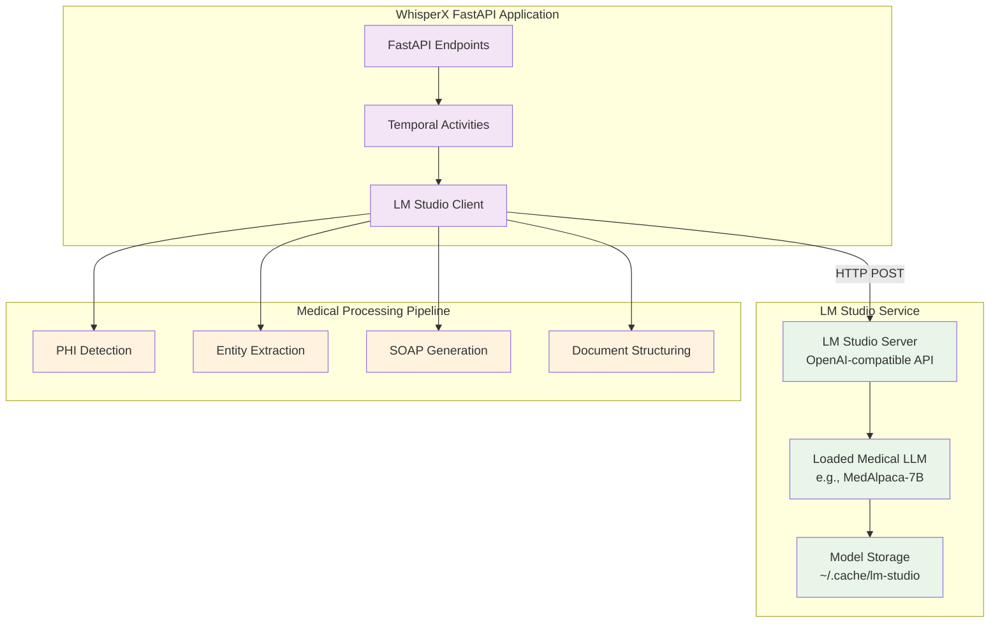

# ADR 002: LM Studio Integration for Local Medical LLM Operations

- **Date**: 2025-12-13  
- **Status**: Proposed  
- **Decision Makers**: ML Engineering & Architecture Teams  
- **Related**: [ADR 001](001-performance-optimization-strategy.md), [ADR 004](004-hipaa-compliance-opensource.md)

## Context

The Healthcare RAG integration requires medical LLM capabilities while maintaining:
- **Complete data privacy**: No external API calls, all processing on-premises
- **HIPAA compliance**: Full control over PHI data
- **Flexibility**: Easy model switching and testing
- **Developer experience**: Simple setup and debugging

**Challenge**: Direct HuggingFace Transformers integration requires complex model loading and management code, manual GPU memory optimization, difficult model switching, and steep learning curve for configuration.

## Decision

Adopt **LM Studio's OpenAI-compatible API** (`http://localhost:1234/v1`) as the primary interface for all medical LLM operations.

### Architecture Overview

### Recommended Models

#### For Medical Operations
1. **MedAlpaca-7B** or **MedAlpaca-13B** - Specialized medical LLM with good accuracy/speed balance
2. **Meditron-7B** - Medical-domain specific with strong clinical reasoning
3. **BioMistral-7B** - Mistral-based medical model with excellent instruction following

#### For Embeddings
1. **nomic-embed-text-v1.5** - 768-dimensional, excellent for medical text similarity
2. **all-MiniLM-L6-v2** - Lightweight and fast, 384 dimensions

## Consequences

### Positive
- **Simple Integration**: Standard OpenAI API with familiar interface
- **Model Flexibility**: Easy to switch models via LM Studio UI
- **Developer Experience**: Visual model management, testing, and debugging
- **HIPAA Compliant**: All processing local, no external API calls
- **Zero API Costs**: No commercial LLM charges
- **Production Ready**: LM Studio handles model optimization automatically
- **Lower Code Complexity**: No manual model loading/management code

### Negative
- **Additional Service**: Requires LM Studio running alongside application
- **Memory Overhead**: LM Studio keeps model loaded in memory
- **Setup Step**: Users must install and configure LM Studio
- **Model Download**: Medical models (7B-13B) require significant download time
- **Performance**: Slightly slower than direct model inference

### Risks
- LM Studio server downtime impacts medical processing
- Model loading time on LM Studio startup (2-5 minutes for 7B models)
- Need to ensure LM Studio version compatibility
- Limited to models supported by LM Studio

## Mitigation Strategies

### Graceful Degradation
Medical processing includes fallback to skip processing if LM Studio is unavailable, returning basic transcript without medical enhancements.

### Health Monitoring
API health check endpoint to verify LM Studio service availability and list loaded models.

### Model Preloading
Pre-deployment script to verify required medical models are loaded before application startup.

## Performance Expectations

### With 7B Model on GPU
- PHI Detection: 2-4 seconds
- Entity Extraction: 3-6 seconds
- SOAP Generation: 5-10 seconds
- Document Structuring: 3-5 seconds
- **Total: ~15-25 seconds**

### With 7B Model on CPU
- PHI Detection: 8-15 seconds
- Entity Extraction: 10-20 seconds
- SOAP Generation: 20-40 seconds
- Document Structuring: 10-15 seconds
- **Total: ~50-90 seconds**

### Comparison vs Direct HuggingFace
- **Setup Time**: LM Studio wins (GUI vs code)
- **Inference Speed**: Direct slightly faster (no HTTP overhead)
- **Development Experience**: LM Studio wins (model switching, testing)
- **Production Deployment**: Either works, LM Studio simpler

## Alternatives Considered

1. **Direct HuggingFace Transformers**: More complex, harder to iterate
2. **External LLM APIs (OpenAI/Anthropic)**: HIPAA compliance issues, API costs
3. **Custom model serving infrastructure**: Over-engineered for initial deployment
4. **vLLM or TensorRT-LLM**: Higher setup complexity, less developer-friendly

## References
- [LM Studio Documentation](https://lmstudio.ai/docs)
- [LM Studio OpenAI API Compatibility](https://lmstudio.ai/docs/api)
- [MedAlpaca Models](https://github.com/kbressem/medAlpaca)
- [Meditron Models](https://huggingface.co/epfl-llm/meditron-7b)
- [Nomic Embed Models](https://huggingface.co/nomic-ai/nomic-embed-text-v1.5)