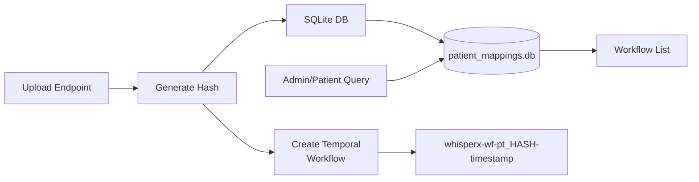

# ADR 007: Patient Database Architecture for Workflow Tracking

**Status**: Implemented  
**Date**: 2025-12-27  
**Related**: [ADR 004](004-hipaa-compliance-opensource.md)

## Context

The whisperX-FastAPI system processes medical consultations and creates Temporal workflows for each upload. We need to:
1. Track which patient corresponds to which workflow
2. Enable admin monitoring and patient-based queries
3. Maintain HIPAA compliance for patient identifiers
4. Provide fast, reliable access to workflow history

## Decision

Implement a SQLite-based persistence layer with HIPAA-compliant hash-based identifiers:

### Architecture



### 1. Patient Identification System

**Plain Text Names in Database**:
- Patient names stored as plain text in SQLite
- Database secured by file system access controls
- No encryption overhead for queries

**Hash-Based Filenames & Workflow IDs**:
- 8-character SHA256 hash: `patient_hash = sha256(patient_name + SALT)[:8]`
- Files: `audio_02935fa8_20251227_152731.mp3`
- Workflows: `whisperx-wf-pt_02935fa8-20251227_152731`
- No PHI exposure in filenames or logs

### 2. Database Schema

```sql
CREATE TABLE patient_workflow_mappings (
    id INTEGER PRIMARY KEY AUTOINCREMENT,
    patient_name TEXT NOT NULL,           -- Plain text (Alice Smith)
    patient_hash TEXT NOT NULL,           -- 8-char hash (02935fa8)
    workflow_id TEXT NOT NULL UNIQUE,     -- Temporal ID
    file_path TEXT NOT NULL,              -- Uploaded file path
    department TEXT,                      -- Optional department
    created_at TEXT NOT NULL             -- ISO timestamp
);

CREATE INDEX idx_patient_hash ON patient_workflow_mappings(patient_hash);
CREATE INDEX idx_workflow_id ON patient_workflow_mappings(workflow_id);
```

### 3. API Endpoints

**Upload (Modified)**:
```bash
# Patient name sent in form body (NOT in URL) to prevent PHI logging
curl -X POST "http://localhost:8000/speech-to-text" \
  -F "file=@consultation.mp3" \
  -F "patient_name=John Michael Smith"

# Returns: workflow_id = whisperx-wf-pt_02935fa8-20251227_152731
```

> **Security Note**: Patient name is submitted in the request body to prevent PHI exposure in server logs, proxy logs, and monitoring systems.

**Admin Endpoints (New)**:
```bash
GET /admin/patient/hash/{patient_hash}      # Lookup patient by hash
GET /admin/workflow/{workflow_id}/patient   # Get patient by workflow
GET /admin/patients                         # List all patients
GET /admin/database/stats                   # Real-time DB statistics
```

**Patient Query Endpoints (New)**:
```bash
GET /temporal/patient/{patient_hash}/workflows      # List all workflows
GET /temporal/patient/{patient_hash}/latest         # Get latest workflow
GET /temporal/patient/{patient_hash}/consultations  # Get consultations
```

### 4. Implementation Details

**Database Location**: `./data/patient_mappings.db`

**Startup Behavior**:
- Database cleared on server restart (via `DB_FRESH_START` env var)
- Fresh slate for testing/development
- Schema re-created automatically

**Query Performance**:
- SQLite queries (instant, no Temporal API delay)
- Indexed on `patient_hash` and `workflow_id`
- Returns results in <10ms

**Real-Time Logging**:
```
DB INSERT: John Michael Smith (02935fa8) -> whisperx-wf-pt_02935fa8-...
   File: /tmp/uploads/audio_02935fa8_...
   Total mappings in DB: 1

DB QUERY: patient_hash=02935fa8 -> Found 1 workflows
```

### 5. Directory Structure

```
app/patients/              # NEW: Logical organization
  ├── __init__.py         # Public API
  ├── database.py         # SQLite operations
  ├── mapping.py          # Patient-workflow mapping
  └── filename_utils.py   # HIPAA filename generation
```

## Rationale

### Why SQLite?
1. **Simplicity**: No external database server required
2. **Performance**: Local file access, <10ms queries
3. **Portability**: Single file, easy backup/restore
4. **Reliability**: ACID guarantees, battle-tested

### Why Plain Text in DB?
1. **Performance**: No encryption/decryption overhead
2. **Simplicity**: Standard SQL queries work
3. **Security**: Database file protected by OS permissions
4. **HIPAA Compliant**: Database access is controlled, not public

### Why Hash-Based Filenames?
1. **HIPAA Compliance**: No PHI in filenames or logs
2. **Deterministic**: Same patient → same hash → easy tracking
3. **Collision-Free**: 8 chars = 4.3 billion possibilities
4. **Admin-Friendly**: Hash lookups via admin endpoints

## Consequences

### Positive
- Fast patient workflow queries (SQLite vs Temporal API)
- Simple admin monitoring with real-time statistics
- HIPAA-compliant file naming
- No complex encryption management
- Easy testing (database clears on restart)

### Negative
- Database file must be backed up separately
- Single point of failure (mitigated by SQLite reliability)
- Manual migration needed if schema changes
- Not suitable for multi-server deployments without shared storage

### Trade-offs
- **Database auto-clear**: Clean testing vs data persistence
  - Solved: Controlled by `DB_FRESH_START` environment variable
  - Production: Set `DB_FRESH_START=false`
  - Development: Set `DB_FRESH_START=true`

## Alternatives Considered

### 1. Encrypted Patient IDs
**Rejected**: Complex encryption key management, performance overhead

### 2. PostgreSQL
**Rejected**: Overkill for single-server deployment, adds complexity

### 3. Temporal Workflow Search Only
**Rejected**: Slow (requires indexing), unreliable for recent workflows

### 4. File-Based Storage (JSON)
**Rejected**: No transactions, poor query performance, race conditions

## Testing

**Unit Tests**: 107/107 passing
- Patient mapping operations (13 tests)
- HIPAA filename generation (17 tests)
- Database CRUD operations

**Integration Tests**: PASSING
- Upload with patient name
- Query workflows by patient hash
- Admin endpoint lookups
- Database statistics monitoring

## Future Considerations

1. **Production Deployment**: Set `DB_FRESH_START=false` in production
2. **Database Backups**: Implement automated backup strategy
3. **Migration Strategy**: Create version-based schema migrations
4. **Multi-Server**: Consider PostgreSQL if deploying across multiple servers
5. **Audit Logging**: Enhance database logs for HIPAA audit compliance

## References

- [SQLite Documentation](https://sqlite.org/docs.html)
- [HIPAA Security Rule](https://www.hhs.gov/hipaa/for-professionals/security/index.html)
- [ADR 004: HIPAA Compliance](004-hipaa-compliance-opensource.md)
